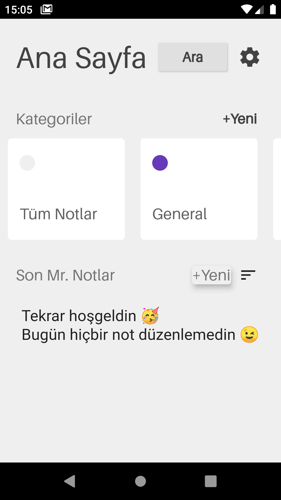
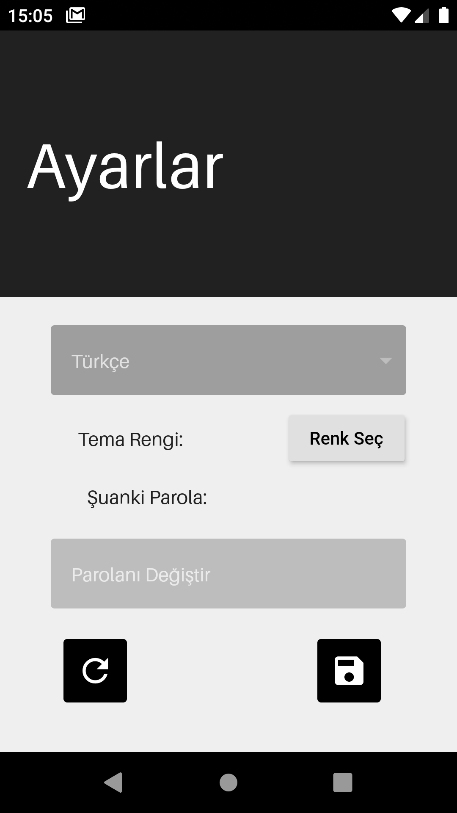
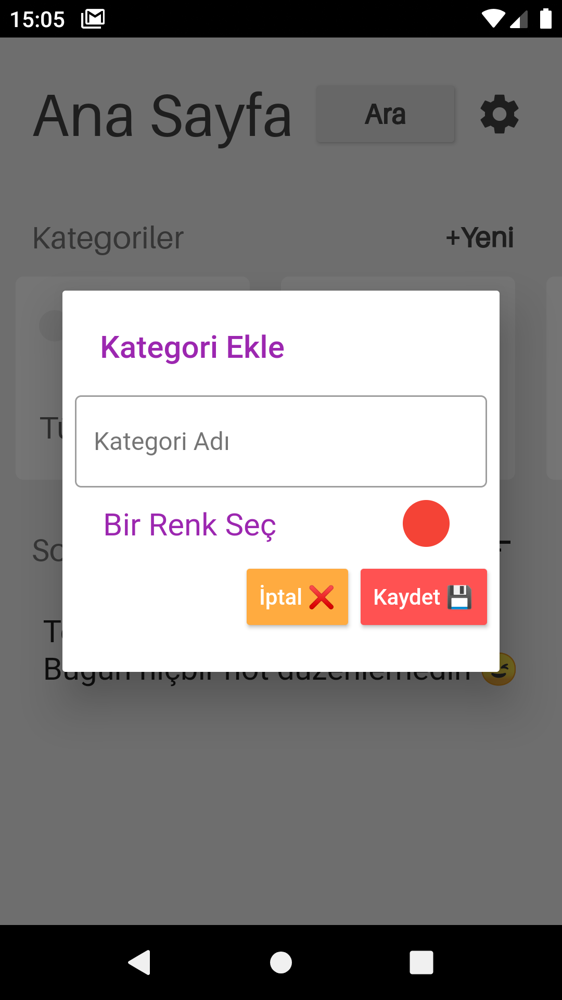
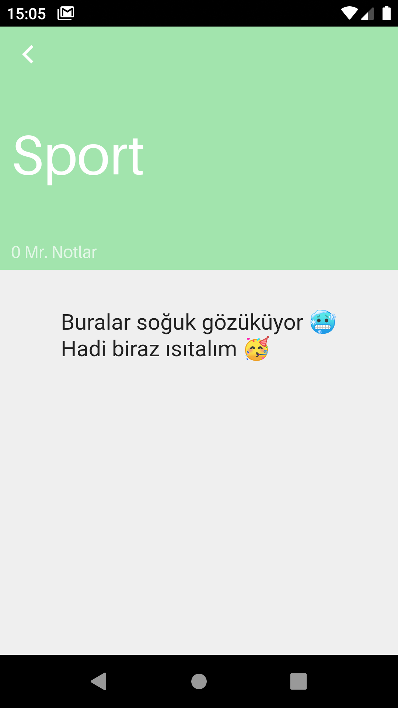
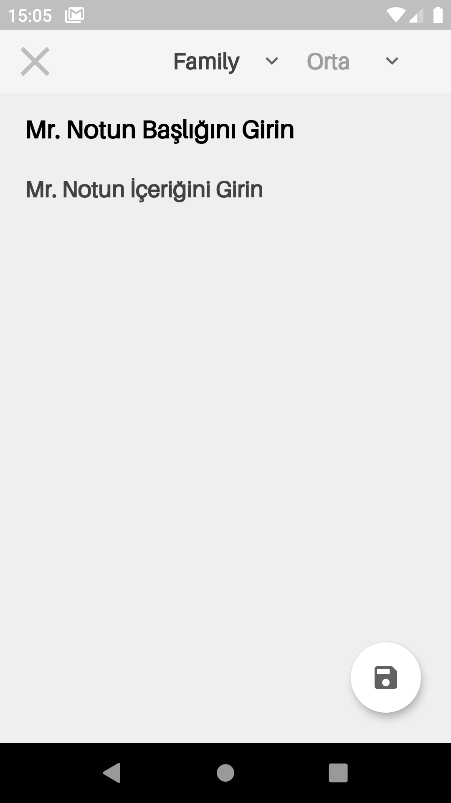
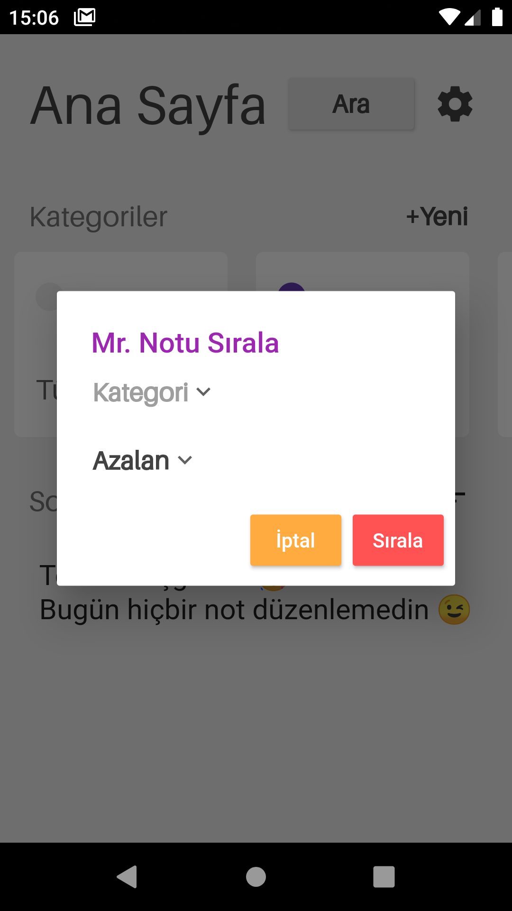

  
  
Merhaba Arkadaşlar!  
Bugün sizlere yayınladığım ilk uygulamam olan **Mr. Note** u tanıtmak istiyorum.  
Notlarınızı güvenle saklayabileceğiniz bir **Flutter** uygulaması.  
**Mr. Not** uygulamasını şifreniz ile kilitleyebilirsiniz.  
Başlığı ve içeriği olan bir Not oluşturabilirsiniz.  
Bir kategori oluşturabilir / silebilir ve **Mr. Not**unuzu kategorilere ayırabilirsiniz.  
**Mr. Not**larınıza öncelik verebilirsiniz.  
Kategorilerinize renk verebilirsiniz.  
**Mr. Not**larınızda arama yapabilirsiniz.  
Mr. Note Tanıtım Videosu: https://cutt.ly/KWzqKG4  
Mr. Note : https://cutt.ly/Njsig6I

## Güncelleme Notları

  
   
<b> <samp> v2.6.0 </samp></b>

     * &nbsp;&nbsp;&nbsp;&nbsp;Mr. Not düzenleme sayfasında arka plan rengi dinamik bir şekilde değişiyor.  
       
     * &nbsp;&nbsp;&nbsp;&nbsp;Kategori kaldırma dialog mesajı güncellendi.  
        
     * &nbsp;&nbsp;&nbsp;&nbsp;Mr. Not düzenleme sayfasındaki çarpı ikonu sorunu düzeltildi.  
        
     * &nbsp;&nbsp;&nbsp;&nbsp;Ana sayfada isteğe bağlı olarak kategori başlığına göre Mr. Notlar sıralanıyor.  
        
     * &nbsp;&nbsp;&nbsp;&nbsp;Ayarlar sayfasında şifre güncellenince ekran güncelleniyor.
      
     * &nbsp;&nbsp;&nbsp;&nbsp;Kategori sayfasına yeni Mr. Not oluşturma butonu eklendi.
      
     * &nbsp;&nbsp;&nbsp;&nbsp;Sayfalarda performans iyileştirmeleri yapıldı. 
 

 
  
   
<b> <samp> Önceki Sürümler </samp></b>

 
  
   
<b> <samp> v2.5.1 </samp></b>

     * &nbsp;&nbsp;&nbsp;&nbsp;Ana sayfadaki bir Mr. Notu düzenledikten sonra siyah ekrana düşme sorunu çözüldü   
 

 
  
   
<b> <samp> v2.5.0 </samp></b>

     * &nbsp;&nbsp;&nbsp;&nbsp;Hiçbir kategori yokken Mr. Note oluşturmaya çalışılınca uyarı sayfası gösteriliyor.
    
     * &nbsp;&nbsp;&nbsp;&nbsp;Siyah tema için bazı renk düzenlemeleri.
    
     * &nbsp;&nbsp;&nbsp;&nbsp;Bazı Mr. Note içeriklerinin card a sığmaması düzeltildi.
 

 
  
   
<b> <samp> v2.4.2 </samp></b>

     * &nbsp;&nbsp;&nbsp;&nbsp;Ana Sayfadaki geçiş reklamı kaldırıldı.
 

 
  
   
<b> <samp> v2.4.1 </samp></b>

     * &nbsp;&nbsp;&nbsp;&nbsp;Mr. Note detay sayfasında bir değişiklik olduğunda kullanıcıyı uyarma eklendi.
 

 
  
   
<b> <samp> v2.4.0 </samp></b>

     * &nbsp;&nbsp;&nbsp;&nbsp;Mr. Note detay sayfasında bir değişiklik olduğunda kullanıcıyı uyarma eklendi.
 

 
  
   
<b> <samp> v2.3.2 </samp></b>

     * &nbsp;&nbsp;&nbsp;&nbsp;Mr. Not Detay sayfasında kaydet butonunun klavyenin üstüne çıkma sorunu çözüldü.
    
     * &nbsp;&nbsp;&nbsp;&nbsp;Mr. Notların ekrana sığmama sorunu çözüldü.
 

  
   
<b> <samp> v2.3.1 </samp></b>

     * &nbsp;&nbsp;&nbsp;&nbsp;Mr. Not detay sayfasında üst kısma kaydırma özelliği eklendi.
 

 
  
   
<b> <samp> v2.3.0 </samp></b>

     * &nbsp;&nbsp;&nbsp;&nbsp;Ayarlar optimize hale getirildi.
 

 
  
   
<b> <samp> v2.2.2 </samp></b>

     * &nbsp;&nbsp;&nbsp;&nbsp;Mr. Notların ekrana sığmama sorunu çözüldü
 

 
  
   
<b> <samp> v2.2.1 </samp></b>

     * &nbsp;&nbsp;&nbsp;&nbsp;küçük reklam düzeltemesi
 

  
   
<b> <samp> v2.2.0 </samp></b>

     * &nbsp;&nbsp;&nbsp;&nbsp;Çıkmadan önce emin misiniz ekranı eklendi.
    
     * &nbsp;&nbsp;&nbsp;&nbsp;Bildirim Sistemi eklendi.
    
     * &nbsp;&nbsp;&nbsp;&nbsp;Şimdi Mr. Notları sıralama kişiselleştirilebilir.
    
     * &nbsp;&nbsp;&nbsp;&nbsp;Parola değiştirme Ayarlara taşındı.
    
     * &nbsp;&nbsp;&nbsp;&nbsp;Ayarlar optimize edildi.
    
     * &nbsp;&nbsp;&nbsp;&nbsp;Yeni tasarım uygulandı.
    
     * &nbsp;&nbsp;&nbsp;&nbsp;Kategorilere renk ekleme özelliği eklendi.
    
     * &nbsp;&nbsp;&nbsp;&nbsp;Notlarda arama özelliği eklendi.
 

 
  
   
<b> <samp> v1.3.91 </samp></b>

     * &nbsp;&nbsp;&nbsp;&nbsp;Çıkış için onay ekranı eklendi.
 

 
  
   
<b> <samp> v1.3.9 </samp></b>

     * &nbsp;&nbsp;&nbsp;&nbsp;Mr. Not Detay sayfasında görünüm geliştirmeleri.
   
     * &nbsp;&nbsp;&nbsp;&nbsp;Dil hatası çözüldü.
   
     * &nbsp;&nbsp;&nbsp;&nbsp;Mr. Not son seçtiğiniz kategoride kalır.
 

 
  
   
<b> <samp> v1.3.8 </samp></b>

     * &nbsp;&nbsp;&nbsp;&nbsp;Mr. Not Detay sayfasında görünüm geliştirmeleri.
   
     * &nbsp;&nbsp;&nbsp;&nbsp;Dil hatası çözüldü.
   
     * &nbsp;&nbsp;&nbsp;&nbsp;Mr. Not son seçtiğiniz kategoride kalır.
 

 
  
   
<b> <samp> v1.3.4 </samp></b>

     * &nbsp;&nbsp;&nbsp;&nbsp;Mr. Note Detay Sayfası Güncellendi.
   
     * &nbsp;&nbsp;&nbsp;&nbsp;Yeni Mr. Note oluştur butonuna animasyon eklendi.
   
     * &nbsp;&nbsp;&nbsp;&nbsp;Giriş ekranı verimli hale getirildi.
   
     * &nbsp;&nbsp;&nbsp;&nbsp;Dil ve Tema verimli hale getirildi.
 

 
  
   
<b> <samp> v1.3.2 </samp></b>

     * &nbsp;&nbsp;&nbsp;&nbsp;Mr. Note Detay Sayfası Güncellendi.
   
     * &nbsp;&nbsp;&nbsp;&nbsp;Yeni Mr. Note oluştur butonuna animasyon eklendi.
   
     * &nbsp;&nbsp;&nbsp;&nbsp;Giriş ekranı verimli hale getirildi.
 

  
   
<b> <samp> v1.2.0 </samp></b>

     * &nbsp;&nbsp;&nbsp;&nbsp;Tema ayarı eklendi
 

  
   
<b> <samp> v1.1.0 </samp></b>

     * &nbsp;&nbsp;&nbsp;&nbsp;Türkçe dili eklendi
 

## 📱 Projenin Kurulumu

Proje'yi çalıştırmak için **Flutter**, **Android Studio** veya **Vs Code** ve minumum API 21 olan
bir **Emulator**'ün bilgisayarınızda yüklü olması gerekmektedir. Bu kurulumları tamamladıktan sonra
gerekli olan paketlerin kurulabilmesi için **flutter pub get** komutunu çalıştırıyoruz. Bu işlemden
sonra gerekli paketler kuruluyor. Son olarak emülatörü açarak projeyi çalıştırmak için **Android
Studio** veya **Vs Code** da **Run** demeniz gerekiyor.

&nbsp;&nbsp;&nbsp;&nbsp;
&nbsp;&nbsp;&nbsp;&nbsp;

&nbsp;&nbsp;&nbsp;&nbsp;
&nbsp;&nbsp;&nbsp;&nbsp;

<h2> 🛠 &nbsp;Kullanılan Teknolojiler</h2>  

  
<table style"float:right;">  
  <tr>  
    <td></td>
    <td></td>  
    <td></td>  
  </tr>  
  <tr>  
    <td></td>  
    <td>  
    <td></td>  
  </tr>  
  <tr>  
    <td></td>  
    <td> </td>  
    <td></td>  
  </tr> 
</table>

## Tanıtım Videosu

## Play Store

## :phone: İletişim  
  
  
  
 
  
   
<b> <samp> İletişime Geçin </samp></b>
  
      
   <samp>  
   <b><h2 style="color: #fc6203">HAKKICAN&nbsp; BÜLÜÇ</h2></b>  
     
        
     Projenin Linki: <a href="https://github.com/MrBuluc/mrnote">Mr. Note</a>  
        
        
     LinkedIn: <a href="https://www.linkedin.com/in/hakkican-buluc/"> LinkedIn Hesabım</a>  
        
     Instagram: <a href="https://www.instagram.com/mrbuluc/"> Instagram Hesabım</a>  
        
     Facebook: <a href="https://www.facebook.com/hakkican.buluc/"> Facebook Hesabım</a>  
        
     Mail Adresim: <a href="#"> hakkicanbuluc@gmail.com</a>  
   </samp>  
 

